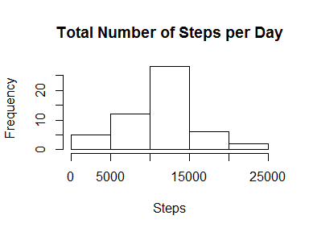
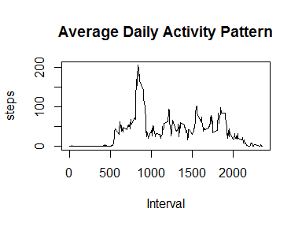
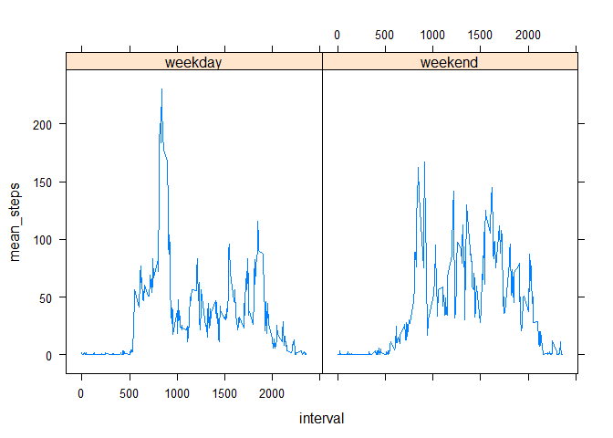

# Reproducible Research: Peer Assessment 1


## Loading and preprocessing the data

1. Download the [data](https://d396qusza40orc.cloudfront.net/repdata%2Fdata%2Factivity.zip) to the working directory and extract the .csv file.

2. Load the data into a table.

```r
  activity_data <- read.csv("activity.csv", colClasses = c("integer", "Date", "integer"))
```


## What is mean total number of steps taken per day?

For this part of the assignment, you can ignore the missing values in the dataset.

1. Make a histogram of the total number of steps taken each day

  * First, we need to aggregate the total number of steps per day.

```r
  daily_steps <- aggregate(steps ~ date, data = activity_data, sum)
```
  
  * Then, create the histogram.

```r
  hist(daily_steps$steps, main = "Total Number of Steps per Day", xlab = "Steps")
```

 

2. Calculate and report the mean and median total number of steps taken per day.

```r
  mean(daily_steps$steps)
```

```
## [1] 10766.19
```

```r
  median(daily_steps$steps)
```

```
## [1] 10765
```


## What is the average daily activity pattern?

1. Make a time series plot (i.e. type = "l") of the 5-minute interval (x-axis) and the average number of steps taken, averaged across all days (y-axis)

  * First, we need to find the mean for the number of steps per 5-minute interval.

```r
  interval_steps <- aggregate(steps ~ interval, data = activity_data, mean)
```
  
  * Then, create the time series plot.

```r
  plot(interval_steps$interval, 
       interval_steps$steps, 
       type= "l", 
       main = "Average Daily Activity Pattern", 
       xlab = "Interval", ylab = "steps")
```

 


2. Which 5-minute interval, on average across all the days in the dataset, contains the maximum number of steps?

  * What is the maximum number of steps?

```r
  max(interval_steps$steps)
```

```
## [1] 206.1698
```

  * Store the row number of the maximum in a variable.

```r
  index <- which.max(interval_steps$steps)
```

  * Return the interval where the maximum occurs.

```r
  interval_steps$interval[index]
```

```
## [1] 835
```


## Imputing missing values
Note that there are a number of days/intervals where there are missing values (coded as NA). The presence of missing days may introduce bias into some calculations or summaries of the data.

1. Calculate and report the total number of missing values in the dataset (i.e. the total number of rows with NAs)


```r
  sum(is.na(activity_data$steps))
```

```
## [1] 2304
```

2. Devise a strategy for filling in all of the missing values in the dataset. The strategy does not need to be sophisticated. For example, you could use the mean/median for that day, or the mean for that 5-minute interval, etc.

  * We'll use the mean for the 5-minute interval that we previously stored in the variable `interval_steps`.

3. Create a new dataset that is equal to the original dataset but with the missing data filled in.

  * First, merge the `activity_data` table to the mean values in `interval_steps`.

```r
  complete_activity_data <- merge(activity_data, interval_steps, by = "interval")
```

  * Change the column names so we can tell which variable is in each column.

```r
  colnames(complete_activity_data) <- c("interval", "steps", "date", "mean_steps")
```

  * Then, replace the NA values with the mean values.

```r
  complete_activity_data$steps[is.na(complete_activity_data$steps)] <- complete_activity_data$mean_steps[is.na(complete_activity_data$steps)]
```

  * Finally, remove the extra column.

```r
  complete_activity_data$mean_steps <- NULL
```


4. Make a histogram of the total number of steps taken each day and Calculate and report the mean and median total number of steps taken per day. Do these values differ from the estimates from the first part of the assignment? What is the impact of imputing missing data on the estimates of the total daily number of steps?

  * Aggregate the total number of steps taken each day.

```r
  complete_daily_steps <- aggregate(steps ~ date, data = complete_activity_data, sum)
```
  
  * Create the histogram.

```r
  hist(complete_daily_steps$steps, main = "Total Number of Steps per Day", xlab = "Steps")
```

 

  * Calculate and report the mean and median total number of steps taken per day.

```r
  mean(complete_daily_steps$steps)
```

```
## [1] 10766.19
```

```r
  median(complete_daily_steps$steps)
```

```
## [1] 10766.19
```

Since we replaced the NAs with average values, the results of this part of the assignment are pretty similar to the results we get when we ignore the NAs.  However, since we've replaced the missing values, each of the bars on the histogram has a greater frequency.


## Are there differences in activity patterns between weekdays and weekends?

For this part the weekdays() function may be of some help here. Use the dataset with the filled-in missing values for this part.

1. Create a new factor variable in the dataset with two levels -- "weekday" and "weekend" indicating whether a given date is a weekday or weekend day.


```r
complete_activity_data$day_of_week <- weekdays(complete_activity_data$date)

complete_activity_data$level <- ifelse((complete_activity_data$day_of_week == "Saturday" | complete_activity_data$day_of_week == "Sunday") == TRUE, "weekend", "weekday")
```


2. Make a panel plot containing a time series plot (i.e. type = "l") of the 5-minute interval (x-axis) and the average number of steps taken, averaged across all weekday days or weekend days (y-axis).


```r
library(dplyr)
```

```
## 
## Attaching package: 'dplyr'
## 
## The following object is masked from 'package:stats':
## 
##     filter
## 
## The following objects are masked from 'package:base':
## 
##     intersect, setdiff, setequal, union
```

```r
library(lattice)

level_means <- complete_activity_data %>% group_by(level, interval) %>% summarize(mean_steps = mean(steps))

xyplot(mean_steps ~ interval | level, data = level_means, type = "l", layout = c(2,1))
```

 
